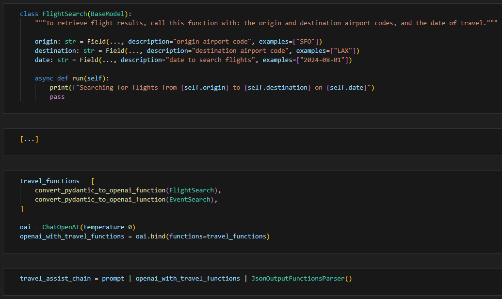
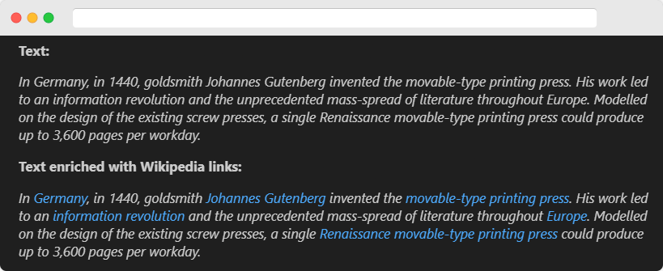
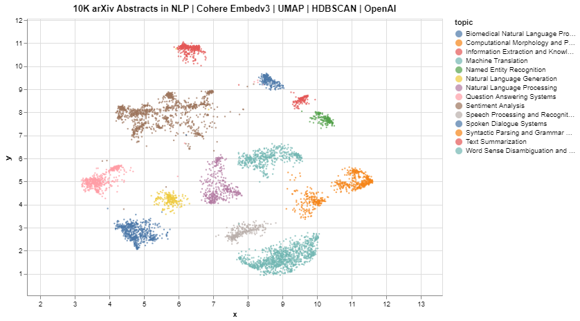

# Notebooks for ML Tasks w/ Scikit and LLMs

Jupyter notebooks to apply and experiment with ML and  Large Language Models (LLMs) provided by industry leaders such as Cohere, HuggingFace, LangChain, and OpenAI.

- [01. Binary Classification w/ SVM and Transformer-based Embeddings](https://github.com/turinglayer/notebooks#01-binary-classification-w-svm-and-transformer-based-embeddings)
- [02. Multiclass Classification w/ Random Forest and Transformer-based Embeddings](https://github.com/turinglayer/notebooks#02-multiclass-classification-w-random-forest-and-transformer-based-embeddings)
- [03. Multiclass Classification w/ Cohere-Classify](https://github.com/turinglayer/notebooks#03-multiclass-classification-w-cohere-classify)
- [04. OpenAI Functions w/ Langchain and Pydantic](https://github.com/turinglayer/notebooks#04-openai-functions-w-langchain-and-pydantic)
- [05. Named Entity Recognition to Enrich Text](https://github.com/turinglayer/notebooks#05-named-entity-recognition-to-enrich-text)
- [06. Clustering and Topic Modeling of arXiv dataset (10k) w/ Cohere Embedv3 | Pydantic | OpenAI | LangChain](https://github.com/turinglayer/notebooks#05-named-entity-recognition-to-enrich-text)


### 01. Binary Classification w/ SVM and Transformer-based Embeddings 

[[Notebook]](./01_binary_classification_svm.ipynb)
[[Open in Colab]](https://colab.research.google.com/github/turinglayer/notebooks/blob/main/01_binary_classification_svm.ipynb)

Tags: `[binary-classification]` `[embeddings]` `[svm]` `[cohere]` `[openai]` `[tfidfvectorizer]`

This notebook illustrates how to perform `binary text classification` with just a few hundred samples. It trains a basic `Support Vector Machine` with a collection of labeled financial sentences (400 training samples), and compares its accuracy with: 
- transformer-based embeddings using [Cohere](https://docs.cohere.com/reference/embed).
- transformer-based embeddings using [OpenAI](https://platform.openai.com/docs/api-reference/embeddings).
- frequency-based embeddings using [TfidfVectorizer](https://scikit-learn.org/stable/modules/generated/sklearn.feature_extraction.text.TfidfVectorizer.html).

```python
SVM Binary-Text Classification Accuracy (550 samples):
------------------------------------------------------
w/ Cohere 'embed-english-v3.0': 94.93%
w/ OpenAI 'text-embedding-ada-002': 89.13%
w/ TfidfVectorizer: 65.22%
```

<p align="center">
  
</p>

### 02. Multiclass Classification w/ Random Forest and Transformer-based Embeddings 

[[Notebook]](./02_multiclass_classification_random_forest.ipynb)
[[Open in Colab]](https://colab.research.google.com/github/turinglayer/notebooks/blob/main/02_multiclass_classification_random_forest.ipynb)

Tags: `[multiclass-classification]` `[embeddings]` `[hyperparameter-tuning]` `[random-forest]` `[cohere]` `[countvectorizer]`

This notebook illustrates how to train a `random-forest` model with `hyperparameter tuning` for multiclass classification. It assesses the perfomance of combining said `random-forest` with:
- transformer-based embeddings using [Cohere](https://docs.cohere.com/reference/embed).
- bag-of-words vectorizer using [CountVectorizer](https://scikit-learn.org/stable/modules/generated/sklearn.feature_extraction.text.CountVectorizer.html).

<p align="center">
  
</p>

It achieves `88.80%` accuracy with approximately `200 training samples per class`.

```python
Accuracy: 88.80%

              precision    recall  f1-score   support

    Business       0.85      0.82      0.83        55
    Sci/Tech       0.89      0.85      0.87        65
      Sports       0.90      0.93      0.91        69
       World       0.91      0.95      0.93        61

    accuracy                           0.89       250
   macro avg       0.89      0.89      0.89       250
weighted avg       0.89      0.89      0.89       250
```

### 03. Multiclass Classification w/ Cohere-Classify

[[Notebook]](./03_multiclass_classification_cohere_classify.ipynb)
[[Open in Colab]](https://colab.research.google.com/github/turinglayer/notebooks/blob/main/03_multiclass_classification_cohere_classify.ipynb)

Tags: `[multiclass-classification]` `[cohere]`

This notebook illustrates how to use [Cohere Classify](https://docs.cohere.com/reference/classify) for multiclass classification. It achieves `94.74% accuracy` with approximately `200 training samples per class`.

```python
Accuracy: 94.74%

              precision    recall  f1-score   support

    Business       0.90      0.90      0.90        20
    Sci/Tech       0.96      0.92      0.94        24
      Sports       1.00      0.96      0.98        28
       World       0.92      1.00      0.96        23

    accuracy                           0.95        95
   macro avg       0.94      0.95      0.94        95
weighted avg       0.95      0.95      0.95        95
```

### 04. OpenAI Functions w/ Langchain and Pydantic

[[Notebook]](./04_openai_functions_langchain_pydantic.ipynb)
[[Open in Colab]](https://colab.research.google.com/github/turinglayer/notebooks/blob/main/04_openai_functions_langchain_pydantic.ipynb)

Tags: `[openai]` `[langchain]` `[pydantic]` `[function-calling]` `[function-creation]`

This notebook demonstrates how to combine [LangChain](https://www.langchain.com/) and [Pydantic](https://docs.pydantic.dev/) as an abstraction layer to facilitate the process of creating `OpenAI` `functions` and handling `JSON` formatting.

<p align="center">
  
</p>

### 05. Named Entity Recognition to Enrich Text

[[Notebook]](./05_ner_text_enrich.ipynb)
[[Open in Colab]](https://colab.research.google.com/github/turinglayer/notebooks/blob/main/05_ner_text_enrich.ipynb)

Tags: `[openai]` `[named-entity-recognition]` `[function-calling]` `[function-creation]` `[wikipedia]`

`Named Entity Recognition` (NER) is a `Natural Language Processing` task that identifies and classifies named entities (NE) into predefined semantic categories (such as persons, organizations, locations, events, time expressions, and quantities). By converting raw text into structured information, NER makes data more actionable, facilitating tasks like information extraction, data aggregation, analytics, and social media monitoring.

This notebook demonstrates how to carry out NER with [OpenAI Chat Completion](https://platform.openai.com/docs/api-reference/chat) and [functions-calling](https://platform.openai.com/docs/guides/gpt/function-calling) to enrich a block of text with links to a knowledge base such as Wikipedia.

<p align="center">
  
</p>

*This notebook is also available at [openai/openai-cookbook/examples/Named_Entity_Recognition_to_enrich_text.ipynb](https://github.com/openai/openai-cookbook/blob/main/examples/Named_Entity_Recognition_to_enrich_text.ipynb)*

### 06. Clustering and Topic Modeling of arXiv dataset (10k) w/ Cohere Embedv3 | Pydantic | OpenAI | LangChain

[[Notebook]](./06_clustering_topicmodeling_arxiv.ipynb)
[[Open in Colab]](https://colab.research.google.com/github/turinglayer/notebooks/blob/main/06_clustering_topicmodeling_arxiv.ipynb)

Tags: `[clustering]` `[cohere]` `[embeddings]` `[HDBSCAN]` `[langchain]` `[pydantic]` `[topic-modeling]` `[openai]`

We combine the advanced [Cohere](https://txt.cohere.com/introducing-embed-v3/) and [GPT-4](https://platform.openai.com/docs/models/gpt-4-and-gpt-4-turbo)  Large Langaguge Models with [HDBSCAN](https://en.wikipedia.org/wiki/HDBSCAN), [Pydantic](https://docs.pydantic.dev/) and [LangChain](https://www.langchain.com/) for [Clustering](https://en.wikipedia.org/wiki/Cluster_analysis) and [Topic Modeling](https://en.wikipedia.org/wiki/Topic_model). Our playground is a [dataset of 10,000 research arXiv documents](https://huggingface.co/datasets/dcarpintero/arxiv.cs.CL.embedv3.clustering.medium) from Computational Linguistics (Natural Language Processing) published between 2019 and 2023, and enriched with `title` and `abstract` embeddings that have been generated with the newest [Cohere Embedv3](https://txt.cohere.com/introducing-embed-v3/) for the specific clustering task. To measure the clustering and topic modeling effectiveness, we visualize the outcomes after applying [UMAP](https://en.wikipedia.org/wiki/Uniform_Manifold_Approximation_and_Projection) dimensionality reduction.

<p align="center">
  
</p>